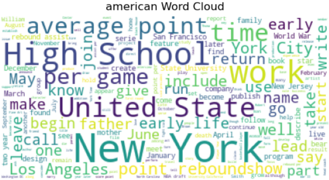
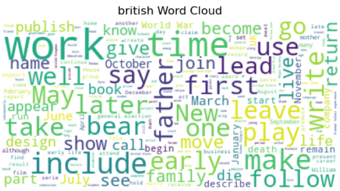
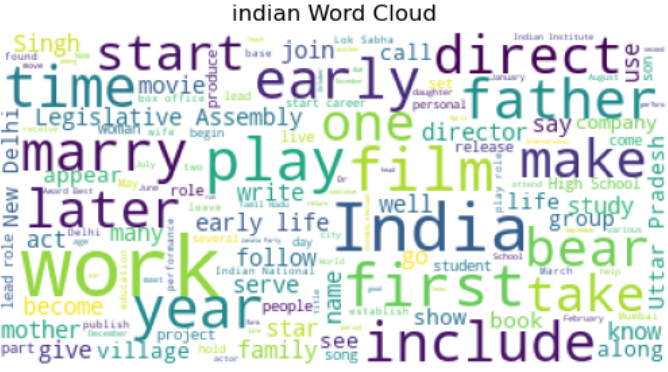
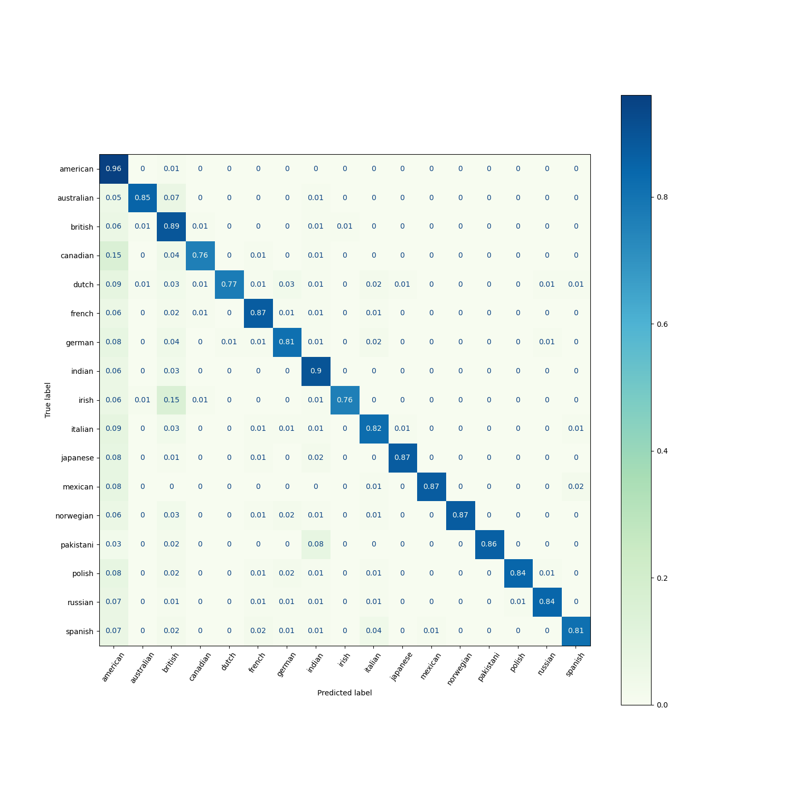
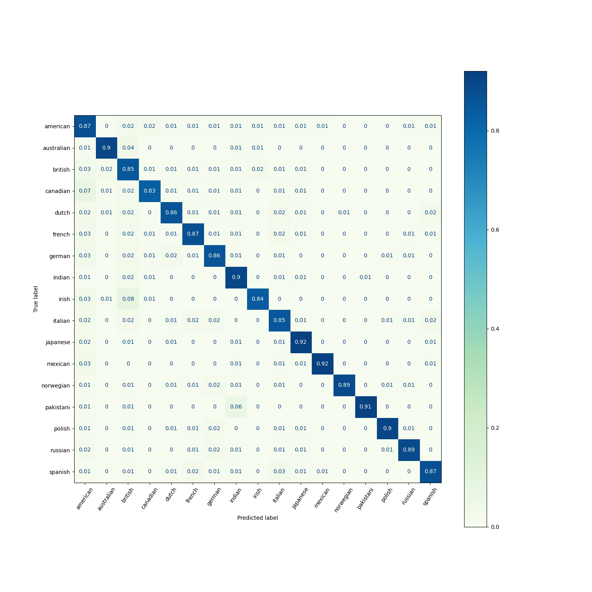

### Biography Based Nationality Prediction

This project aims to predict an individual's nationality based on information from her/his Wikipedia biography, i.e., text analysis based multiclass prediction/classification. 

This project consists of the following key stages:
1. <b>Text Processing:</b> Approximately 319K individual biographies were analyzed which cover more than 20 distinct nationalities. spacy, nltk, regex and sklearn libraries were used to process the text based data prior to modeling.
   * <b>Part 1 - Cleaning the Target (Nationality) Field:</b> Three approaches were considered to clean the target field; (1) Prior Knowledge Based Transformations, (2) Spacy Named Entity Recognition Based Transformations, and (3) a combined approach
   * <b>Part 2 - Cleaning the Biography Field:</b> Typical text based processing consisting of removing stopwords, alpahnumerics and other noise, as well as tokenization and lemmatization is applied to the biographies in the dataset. Some common words seen for the top three nationalities are:
     

    

2. <b>Prediction Modeling:</b> A logistic regression based model was used to predict the nationalities frome the text based biography inputs. Note: the focus of this project is more on gaining experience with text processing rather that classification modeling (which I have covered in other projects), so only logisitc regression is used in this project. Some potential other models that could be explored include Multinomial Naive Baiyes or Random Forest Classification, for instance.
   * <b>Part 1 - Classification Model on the Unbalanced Dataset:</b> The logistic regression model has an aggregate macro f1 score of .87 and micro f1 score .89 
   * <b>Part 2 - Balancing the Dataset:</b> imblearn is used to undersample the dominant classes (nationality is "american" or "british"), followed by SMOTE to oversample all minority classes, such that all classes have 30Krecords each in the dataset. The logistic model on this updated dataset has an aggregate macro f1 score of .85 and micro f1 score .85. While the aggregate scores remain largely the same, we can see in the figure below that minority class performance improves (e.g, "irish")

<b>Confusion Matrix - Unbalanced Dataset</b>

<b>Confusion Matrix - Balanced Dataset</b>

The code files and other relevant details can be found [here](https://github.com/prarid/BiographyBased_NationalityPrediction/blob/main/NationalityPrediction/WikiNationalityPrediction.ipynb)
